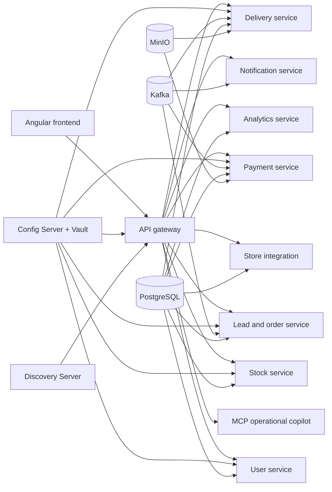

# IntelliOps Platform

IntelliOps is a multi-tenant SaaS platform for coordinating customer acquisition, orders,
inventory, payments, delivery, notifications, external stores, conversational operations, and
business intelligence in one auditable workflow.

This repository contains the application source code, local Docker Compose environment, database
migrations, tests, and CI/CD workflows. Kubernetes deployment state is maintained separately in
the [IntelliOps-GitOps](https://github.com/Oumhella/IntelliOps-GitOps) repository.

## Main capabilities

- Enterprise registration, authentication, refresh tokens, password recovery, and team roles.
- CSM-owned lead qualification and controlled conversion into authoritative orders.
- Catalog, fulfillment locations, reservations, inventory movements, and replenishment alerts.
- Stripe-backed payments, invoices, refunds, and cash-on-delivery reconciliation.
- Courier assignment, delivery lifecycle, customer details, navigation, attempts, and proof.
- Shopify and WooCommerce connections, signed webhooks, product import, and order synchronization.
- Role-aware operational copilot with human-approved write operations.
- Tenant-isolated conversational BI with charts, persistent conversation history, and CSV export.
- Immutable weekly and monthly PDF reports in English, French, and Arabic.
- Super-admin subscription and enterprise administration.

## Architecture



Business APIs are exposed through the gateway. Services use separate PostgreSQL databases, while
the analytics service maintains a read-optimized reporting database protected by tenant-aware row
level security.

## Services

| Component | Port | Responsibility |
| --- | ---: | --- |
| Frontend | 4200 | Angular workspace and public pages |
| Gateway service | 8080 | Routing, JWT enforcement, tenant context, rate limiting |
| User service | 8081 | Identity, enterprises, profiles, roles, authentication |
| Lead service | 8082 | Leads, interactions, orders, lifecycle handoffs |
| Subscription service | 8083 | Plans, subscriptions, workspace entitlement |
| Stock service | 8084 | Products, locations, inventory, reservations, alerts |
| MCP server | 8085 | Read tools and approval-controlled operational actions |
| Payment service | 8086 | Transactions, Stripe integration, refunds, invoices |
| Delivery service | 8087 | Assignment, courier workflow, attempts, proof, COD |
| Notification service | 8089 | In-app, email, and SMS notification dispatch |
| Store integration service | 8090 | Shopify/WooCommerce OAuth, imports, and webhooks |
| Analytics service | 8091 | Conversational BI, history, charts, CSV/PDF reports |
| Discovery server | 8761 | Eureka service registry for local/Spring environments |
| Config server | 8888 | Vault-backed Spring configuration |

PostgreSQL, Redis, Kafka, Vault, and MinIO are also included in the Compose environment.

## Technology stack

- Java 24, Spring Boot, Spring Cloud, Spring Security, Spring Data JPA, and Flyway.
- Python 3.12, FastAPI, Psycopg, SQLGlot, ReportLab, and PostgreSQL RLS.
- Angular 19, TypeScript, RxJS, and Stripe.js.
- PostgreSQL, Redis, Kafka, Vault, MinIO, Docker Compose, Kubernetes, Kustomize, and Argo CD.
- GitHub Actions, Trivy, and Gitleaks for build and security automation.

## Repository layout

```text
analytics-service/          FastAPI BI, synchronization, migrations, PDF reporting
frontend_service/           Angular application
mcp-server/                 Operational assistant and MCP tools
user_service/               Identity and enterprise administration
lead_service/               CRM leads and orders
stock_service/              Products and inventory
abonnement_service/         Plans and subscriptions
paiement_service/           Payments and invoices
delivery_service/           Delivery execution
notification_service/       Notification delivery
store-integration-service/  External commerce integrations
gateway_service/            API gateway
config-server/              Vault-backed configuration server
discovery-server/           Eureka registry
common_lib/                 Shared Java security and domain utilities
docs/                       Architecture and operational documentation
vault/                      Local Vault configuration and initialization
docker/                     Database bootstrap scripts
.github/                    CI/CD workflows and composite actions
docker-compose.yaml         Complete local stack
```

## Prerequisites

- Git
- Docker Desktop with Docker Compose v2
- At least 8 GB of memory available to Docker; 12 GB is recommended for the complete stack
- Java 24 and Maven 3.9+ for direct Java development
- Node.js 20+ and npm for direct frontend development
- Python 3.12 for direct analytics development

## Local configuration

Create an untracked `.env` in the repository root. Never commit real values.

```dotenv
DB_USER=replace_me
DB_PASSWORD=replace_me
JWT_SECRET=replace_with_a_long_random_value

VAULT_LOCAL_UNKEY=replace_me
VAULT_LOCAL_ROOT_TOKEN=replace_me

MINIO_ROOT_USER=replace_me
MINIO_ROOT_PASSWORD=replace_me

ANALYTICS_QUERY_PASSWORD=replace_me
ANALYTICS_SYNC_PASSWORD=replace_me

NVIDIA_API_KEY=
NVIDIA_BASE_URL=https://integrate.api.nvidia.com
NVIDIA_MODEL=meta/llama-3.1-70b-instruct

FRONTEND_PUBLIC_URL=http://localhost:4200
INTEGRATION_PUBLIC_BASE_URL=
INTEGRATION_ORDER_CURRENCY=USD,MAD,EUR
SHOPIFY_API_VERSION=2026-07
SHOPIFY_SCOPES=read_orders,read_products
```

Provider credentials such as Stripe, Shopify, WooCommerce, notification, and AI keys are loaded
through the platform's Vault/configuration flow. Keep local `.env` files and generated Vault data
outside version control.

`REPORT_LOCALES=en,fr,ar` is ordinary configuration, not a secret. The analytics service already
uses these three locales by default.

## Start the platform locally

Validate the resolved Compose configuration first:

```powershell
docker compose config --quiet
```

Build and start the complete stack:

```powershell
docker compose up -d --build
docker compose ps
```

Open:

- Frontend: <http://localhost:4200>
- Gateway: <http://localhost:8080>
- Eureka: <http://localhost:8761>
- Vault: <http://localhost:8200>
- MinIO console: <http://localhost:9001>

Follow a service log:

```powershell
docker compose logs -f analytics-service
```

Stop containers without deleting persistent volumes:

```powershell
docker compose down
```

Do not add `-v` unless you explicitly intend to delete local PostgreSQL, Redis, and MinIO data.

## Analytics operations

The analytics migration runs before the service in Compose. A synchronization can be triggered
manually with:

```powershell
docker compose run --rm analytics-sync
```

Generate reports for the last closed period:

```powershell
docker compose run --rm analytics-service python -m app.reports.runner --period WEEKLY
docker compose run --rm analytics-service python -m app.reports.runner --period MONTHLY
```

See [analytics-service/README.md](analytics-service/README.md) for the reporting model, role scope,
and API endpoints.

## Testing

Java services:

```powershell
mvn test
```

Frontend:

```powershell
cd frontend_service
npm ci
npm run test:ci
npm run build
```

Analytics service:

```powershell
cd analytics-service
python -m pip install -e ".[dev]"
python -m ruff check app tests
python -m pytest -q
```

## CI/CD and GitOps

Service-specific GitHub Actions workflows build and test the changed component, scan its filesystem
and image with Trivy, scan introduced commits with Gitleaks, and push a Docker image tagged with the
immutable Git commit SHA. Successful promotion workflows update the development image tag in the
GitOps repository; Argo CD then reconciles that desired state into Kubernetes.

Required GitHub repository secrets include Docker Hub credentials and the fine-grained
`GITOPS_TOKEN`. Infrastructure integration tests use additional provider secrets configured in
GitHub Actions.

## Security model

- JWT claims establish the authenticated user, enterprise, and role.
- Tenant IDs are derived server-side and must never be trusted from request bodies or LLM output.
- Domain services enforce role ownership and lifecycle transitions.
- AI write operations require a short-lived, caller-bound approval before execution.
- Analytics queries are read-only, bounded, validated, and protected by PostgreSQL RLS.
- Runtime secrets belong in Vault or Kubernetes Secrets, never Git.
- External webhooks are signature-verified and processed idempotently.

## Additional documentation

- [Store integration architecture](docs/store-integration-architecture.md)
- [Platform administration](docs/platform-administration.md)
- [Database migrations](docs/database-migrations.md)
- [Backend gap closure](docs/backend-gap-closure.md)
- [GitOps repository](https://github.com/Oumhella/IntelliOps-GitOps)

## Project status

This repository represents the completed development baseline for the IntelliOps final-year project.
Production adoption would additionally require managed high-availability infrastructure, TLS and
DNS automation, external secret synchronization, backups and disaster recovery, centralized
observability, and environment-specific capacity planning.
